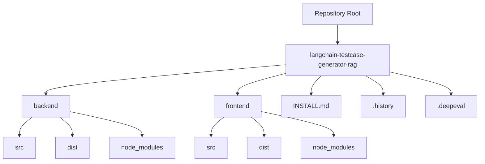
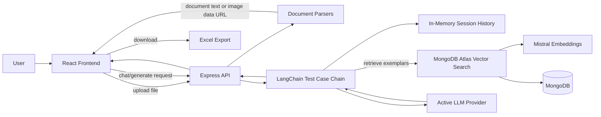
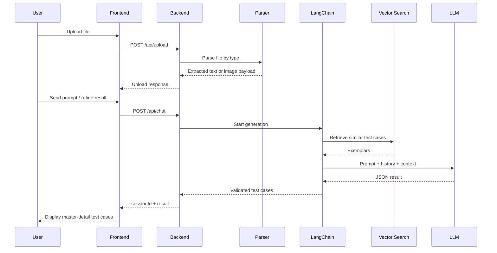

# Test Case Generator Repository Overview

## Table of Contents

 1. [Executive Summary](#executive-summary)
 2. [Repository Shape](#repository-shape)
 3. [Product Purpose](#product-purpose)
 4. [System Architecture](#system-architecture)
 5. [Core User Flows](#core-user-flows)
 6. [Software Architect View](#software-architect-view)
 7. [Software Developer View](#software-developer-view)
 8. [Product Manager View](#product-manager-view)
 9. [Strengths](#strengths)
10. [Risks and Gaps](#risks-and-gaps)
11. [Actionable Recommendations](#actionable-recommendations)
12. [Open Questions](#open-questions)
13. [Verification Notes](#verification-notes)

## Executive Summary

This repository contains a full-stack application for generating QA test cases from either:

- uploaded business requirement documents (`.pdf`, `.docx`, `.xlsx`)
- uploaded UI screenshots (`.png`, `.gif`, and backend-configurable image types)
- follow-up chat prompts that refine previously generated results

The implemented product is best described as a **multimodal LLM-assisted test case generator with conversational refinement**, backed by:

- a React + Vite frontend
- an Express + TypeScript backend
- LangChain orchestration for model prompting
- MongoDB Atlas vector search for retrieving exemplar test cases
- Mistral embeddings for retrieval
- swappable chat/vision providers via environment configuration

The codebase is understandable and relatively compact, but it is still closer to an **MVP / local demo system** than a production-ready platform. The biggest architectural gap is that the "RAG" layer retrieves **similar historical test cases**, not chunks from the uploaded requirements document. The uploaded document text is passed directly to the model, while chunking is computed only for metrics and never used for retrieval.

## Repository Shape

The repository root currently wraps a single app folder:

- `langchain-testcase-generator-rag/`

Inside that app:

- `backend/` contains the API, model orchestration, parsing, and retrieval logic
- `frontend/` contains the React UI
- `.history/` contains editor history snapshots, including historical `.env` snapshots
- `.deepeval/` exists but does not currently contain an active evaluation suite
- `dist/` and `node_modules/` are present in the working tree

### High-Level Layout

## Product Purpose

The user-facing value proposition appears to be:

- let a QA analyst or domain SME upload requirement artifacts
- generate structured test cases in a domain-aware style
- refine them conversationally
- export the final set to Excel

Supported domains:

- banking
- insurance
- hospital
- logistic

The domain selection changes the system prompt, allowing the same generation pipeline to specialize terminology and expected scenarios.

## System Architecture

### Runtime Architecture

### Request Processing Model

## Core User Flows

### 1. Document-Based Generation

1. User uploads a PDF, DOCX, or XLSX.
2. Backend extracts plain text.
3. Frontend places extracted text into the chat input box.
4. User sends the text as a prompt.
5. Backend retrieves similar historical test cases from MongoDB vector search.
6. LLM generates structured JSON test cases.
7. Frontend renders the latest result and allows Excel export.

### 2. Screenshot-Based Generation

1. User uploads an image.
2. Backend converts it to a base64 data URL.
3. Frontend stores the image as a pending attachment.
4. On send, backend calls the vision-capable model path.
5. Result is returned in the same JSON shape as document-based generation.

### 3. Conversational Refinement

1. First chat request creates a `sessionId`.
2. Backend stores user and assistant messages in in-memory LangChain history.
3. Later requests with the same `sessionId` reuse prior conversation.
4. Prompt instructs the model to return the complete updated set of test cases.

## Software Architect View

### Architectural Pattern

The application follows a straightforward layered architecture:

- Presentation layer: React UI
- API layer: Express routes
- Orchestration layer: LangChain chain + prompt/model factories
- Infrastructure layer: MongoDB, vector search, embeddings, file parsing

This is a sensible pattern for an MVP because it keeps the moving parts separated without introducing excessive abstraction.

### What Is Well Designed

- Clear route separation for upload, chat, and one-shot generation
- Centralized environment configuration
- Prompt and model selection abstracted behind factories
- Shared chain logic reused between stateless and conversational generation
- Structured output validation with `zod`
- Good defensive handling of malformed model output
- Ability to switch model providers without changing route code

### Scalability Observations

The current design will work for local use and low concurrency, but several choices limit scale:

- Session memory is in-process only, so it disappears on restart and does not scale horizontally.
- Uploaded documents are not persisted; every request is ephemeral.
- Retrieval depends on MongoDB Atlas vector search, but no ingestion pipeline is wired into the primary UX.
- Large requirement texts are sent directly to the LLM instead of using chunk retrieval.
- No background jobs or async workflow management exist for heavy parsing or long-running generation.
- No auth, rate limiting, tenant isolation, or request quotas are present.

### Important Architectural Insight

Despite the product description using "RAG," the current architecture is **not document-grounded RAG over uploaded content**.

What actually happens:

- uploaded documents are parsed into plain text
- chunk counts are computed
- chunks are not stored or retrieved
- the entire extracted text becomes the prompt input
- vector search retrieves similar past test cases, not requirement chunks

This means the retrieval layer serves more as a **style/example augmentation system** than a full retrieval-augmented knowledge system.

### Architecture Maturity Assessment

| Area | Maturity | Notes |
| --- | --- | --- |
| API structure | Good | Small, readable, consistent |
| LLM orchestration | Good | Clean prompt/model abstraction |
| RAG architecture | Partial | Retrieval exists, but not for uploaded documents |
| State management | Limited | In-memory only |
| Security model | Weak | No auth, likely sensitive files in repo |
| Production readiness | Low to Moderate | Good prototype, not hardened |

## Software Developer View

### Code Structure

The authored source is compact and approachable. Key backend modules are well named:

- `src/routes/*` for HTTP endpoints
- `src/chains/testCaseChain.ts` for generation orchestration
- `src/factories/*` for prompt/model selection
- `src/documents/parsers/*` for file parsing
- `src/tools/vectorSearchTool.ts` for retrieval
- `src/memory/bufferMemory.ts` for session history

Frontend structure is similarly simple:

- `App.tsx` sets the app shell and routing
- `ChatWindow.tsx` owns most user interaction state
- `FileUpload.tsx` handles upload validation and progress
- `TestCaseResultViewer.tsx` renders and exports results
- `services/api.ts` centralizes backend contract calls

### Maintainability Strengths

- Strong naming throughout the codebase
- Minimal hidden logic
- Reasonable separation of concerns
- Helpful comments in the most non-obvious places
- Backend validation before model invocation
- Shared type concepts across frontend and backend

### Maintainability Concerns

#### 1. Chat UI state is concentrated in one component

`frontend/src/components/ChatWindow.tsx` owns:

- message history
- pending image state
- session tracking
- request lifecycle
- input behavior
- result rendering orchestration

It is still manageable, but this is the first file likely to become harder to evolve if:

- chat history rendering expands
- multi-result history is added
- attachments grow beyond one pending image
- streaming or cancellation is introduced

#### 2. Retrieval ingestion path is incomplete

`addTestCaseToKB()` exists, but no route, job, CLI, or admin flow clearly populates the vector store through the normal app experience. That means:

- retrieval may silently depend on external/manual DB seeding
- onboarding a new environment is harder
- the "RAG" capability may appear broken if the collection is empty

#### 3. Chunking is not operationally used

`splitDocumentText()` is called during upload, but only the chunk count is returned. This suggests either:

- a partially implemented document-RAG pipeline
- or leftover logic from an earlier design

This is a maintainability smell because it implies an unfinished architectural branch.

#### 4. API and frontend file-type support are slightly inconsistent

Backend:

- supports `png`, `gif`, `jpg`, `jpeg`, `webp` by extension map
- allows image types based on `ALLOWED_IMAGE_TYPES`

Frontend:

- `accept` only includes `.png,.gif`
- client-side map only recognizes `png` and `gif`
- default client env also implies `png,gif`

Impact:

- a backend-supported image type can still be blocked in the browser UI
- product behavior varies by layer

#### 5. Generated history is intentionally hidden in UI

`ChatWindow.tsx` only renders the latest assistant result and suppresses earlier assistant messages. This is a deliberate design choice, but from a developer perspective it means:

- message history exists in state
- only a subset is shown
- debugging or feature expansion may be confusing later

### Code Quality Notes

- Backend TypeScript strictness is enabled.
- Frontend linting is present but lightweight.
- There are no visible automated tests for core parsing, API contracts, prompt behavior, or UI flows.
- Compiled `dist/` output and dependency directories are present in the repository workspace, which adds noise and risk.
- `.history/` contains historical environment snapshots, which is a serious repository hygiene concern.

## Product Manager View

### Current Product Experience

The app offers a focused, low-friction workflow:

- pick a domain
- upload a requirements file or screenshot
- generate test cases
- refine them via natural language
- export to Excel

This is a strong demo flow because it gets users to value quickly.

### User Personas the Product Serves Well

- QA analysts creating first-draft test coverage
- business analysts turning requirements into structured QA assets
- domain SMEs who need domain-specific terminology in outputs
- teams that still rely on spreadsheet deliverables

### What Feels Strong from a Product Perspective

- Domain-specific prompting improves perceived relevance
- Upload + chat is easier than filling a rigid form
- Screenshot support is a meaningful differentiator
- Refinement via conversation is intuitive
- Excel export matches common QA workflows

### Product Gaps

#### 1. The app lacks provenance and trust signals

Users cannot easily tell:

- which parts of the output came from uploaded requirements
- which parts were inspired by retrieved exemplars
- which provider/model generated the result
- whether any information was inferred or assumed

For QA artifacts, trust and auditability matter.

#### 2. Multi-turn refinement is fragile from a user-education standpoint

Refinement depends on a stable `sessionId`, but users are not explicitly shown:

- that a conversation session exists
- when it resets
- what "New Chat" discards

This is manageable in the current UI, but risky once users expect durable workspaces.

#### 3. The product markets itself as RAG, but user expectations may exceed reality

A user might expect:

- uploaded documents are chunked, stored, and cited
- multiple documents can be combined into a knowledge base
- answers are grounded in retrieved requirement passages

The current implementation does not deliver that full experience.

#### 4. Earlier assistant outputs are not visible

The UI only shows the latest generated result. That keeps the interface clean, but it reduces:

- transparency of how outputs evolved
- ease of comparing revisions
- user confidence in refinement changes

#### 5. No collaboration, persistence, or project structure

There is no notion of:

- saved projects
- saved document sets
- team sharing
- version history
- approval/review workflow

For a serious QA workflow, these likely become important quickly.

## Strengths

- Clear MVP scope with a coherent end-to-end story
- Sensible use of factories for provider and prompt selection
- Good error handling around parsing and malformed LLM output
- Supports both text and vision generation paths
- Domain-aware prompts create immediate product differentiation
- Excel export makes the output operationally useful
- Health endpoint and Postman collection improve local developer usability

## Risks and Gaps

### High Priority

- `.history/` contains historical `.env` snapshots and should be treated as sensitive repository debt.
- The app appears to rely on checked-in `node_modules/` and `dist/`, which bloats the repository and obscures authored code.
- No authentication or authorization is present.
- Session state is in memory only.
- "RAG" is only partial and may not match stakeholder expectations.

### Medium Priority

- No automated tests are visible.
- No ingestion workflow for populating the exemplar vector store is exposed.
- Frontend/backend file support drift can confuse users.
- Large frontend Excel bundle creates a large production chunk.

### Lower Priority

- Single-screen UI may grow cramped as features expand.
- Toast implementation triggers a Fast Refresh lint warning because the file exports both provider and hook utilities.
- `react-router-dom` is present, but routing is currently minimal.

## Actionable Recommendations

### Recommended Next Steps for Architecture

1. Decide whether the product should be:
   - exemplar-augmented generation
   - true document-grounded RAG
   - or both
2. If true RAG is desired, store uploaded document chunks and retrieve them during generation.
3. Move chat session memory to a persistent store such as Redis or MongoDB.
4. Add an ingestion path for historical test cases if exemplar retrieval is a core feature.
5. Add auth, rate limiting, and basic usage controls before broader deployment.

### Recommended Next Steps for Engineering

1. Remove generated and dependency directories from source control.
2. Remove `.history/` from the repository and rotate any exposed secrets if needed.
3. Add automated tests for:
   - upload parsing
   - route validation
   - JSON output parsing/retry behavior
   - core UI flows
4. Align frontend and backend file-type support.
5. Split `ChatWindow.tsx` into smaller stateful and presentational components as the UI evolves.

### Recommended Next Steps for Product

1. Clarify the product promise around "RAG" in docs and UI copy.
2. Expose session state more clearly so users understand refinement behavior.
3. Add provenance features such as:
   - source badges
   - model/provider display
   - retrieved exemplar summaries
4. Consider showing revision history or diff between generations.
5. Add saved workspaces/projects if repeat usage is expected.

## Open Questions

### Product Strategy

- Is the primary goal faster first-draft generation, or auditable requirement-grounded test design?
- Are retrieved historical test cases meant to influence style only, or also business logic coverage?
- Is screenshot generation intended for UI test design specifically, or broader requirement inference?

### Architecture

- Where and how are historical test cases currently seeded into MongoDB?
- Should uploaded documents become durable assets or remain ephemeral?
- Is multi-user deployment a near-term goal?

### Engineering

- Should the frontend eventually support all backend-configurable image formats?
- Is the `.history/` folder intentionally tracked, or is it accidental editor output?
- Is `.deepeval/` a placeholder for an upcoming evaluation framework?

## Verification Notes

The following checks were run during this analysis:

- backend build: `npm run build` in `langchain-testcase-generator-rag/backend` succeeded
- frontend build: `npm run build` in `langchain-testcase-generator-rag/frontend` succeeded
- frontend lint: `npm run lint` in `langchain-testcase-generator-rag/frontend` succeeded with one warning

Observed lint warning:

- `src/components/Toast.tsx` triggers `react/only-export-components` because the file exports both component and hook-related values

Observed frontend build note:

- the Excel export path contributes to a large chunk (`exceljs` is heavy), so code splitting or alternate export strategies may be worthwhile if bundle size matters

## Final Assessment

This repository has a solid foundation for a domain-aware, multimodal QA assistant. Its strongest qualities are clarity, cohesion, and a user flow that reaches value quickly. Its main weaknesses are repository hygiene, missing persistence and security, and a gap between the label "RAG" and the retrieval behavior actually implemented.

If the next goal is a better demo, the product is already close. If the next goal is a production-grade platform, the highest-leverage work is:

- tighten repository and secret hygiene
- make retrieval architecture explicit and complete
- add persistence, observability, and test coverage
- improve user trust with provenance and session transparency
